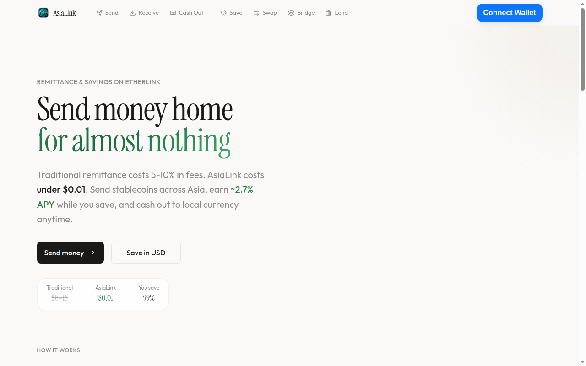

# AsiaLink

**Send money home for less. Save in USD.** Asia's remittance and DeFi savings app on Etherlink.

[Live App](https://asialink-hq.vercel.app) &nbsp;|&nbsp; [Smart Contracts](contracts/src/)



## The Problem

300 million migrant workers across Asia-Pacific send $300B+ home annually. They pay **5-10% in fees** through Western Union, Wise, and local transfer operators. A Filipino worker in Singapore sending $500 home loses $25-50 per transaction — $300-600/year their families need.

Meanwhile, their savings sit in local bank accounts earning 0.1-1% APY, losing value against the dollar.

## How It Works

1. **Pay with local apps** — GCash, GrabPay, PromptPay, Dana, PayNow. A P2P seller matches your order and USDC is released on-chain.
2. **Save in USD** — Deposit into our ERC-4626 vault. Earn yield. No lock-ups. Withdraw anytime.
3. **Send home for $0.01** — Transfer USDC to any wallet with sub-500ms finality on Etherlink. Family cashes out locally.

## What Makes It Different

**YieldEscrow** — Our P2P escrow routes idle USDC into yield vaults while waiting for payment matches. Traditional escrow locks funds doing nothing; ours earns yield for both parties. Buyer deposits USDC, it immediately earns in the vault. Seller confirms payment, yield splits between maker and protocol.

This turns **every pending remittance into a yield-generating position**.

## Architecture

```
User → Pay locally (GCash, GrabPay, PromptPay, Dana, PayNow)
         ↓
     YieldEscrow ←→ StableNestVault (ERC-4626)
         ↓                    ↓
   USDC released      Yield strategies (Superlend, Gearbox, Curve)
         ↓
   Send to family → Cash out locally
```

**Frontend**: 8 pages — Send, Receive, Cash Out, Save, Swap, Bridge, Lend, Dashboard
**Swap & Bridge**: LI.FI Widget aggregating Etherlink DEX liquidity and cross-chain routes
**Yield Data**: Live APY from DeFiLlama across Etherlink lending markets

## Smart Contracts

| Contract | Purpose |
|----------|---------|
| [YieldEscrow](contracts/src/core/YieldEscrow.sol) | P2P escrow with yield routing |
| [StableNestVault](contracts/src/vault/StableNestVault.sol) | ERC-4626 multi-strategy yield aggregator |
| [BaseStrategy](contracts/src/vault/strategies/BaseStrategy.sol) | Pluggable strategy adapter |
| [MockVerifier](contracts/src/verifier/MockVerifier.sol) | Payment verification (Reclaim Protocol in production) |

9/9 tests passing &nbsp;|&nbsp; Solidity 0.8.24 &nbsp;|&nbsp; OpenZeppelin v4.9.6

## Why Etherlink

- **Sub-500ms finality** — transfers confirm before the user blinks
- **Near-zero gas** — $0.01/tx makes micro-remittances ($10-50) viable
- **EVM compatible** — standard Solidity, massive DeFi ecosystem
- **Tezos L1 security** — consensus secured by proof-of-stake

## Supported Corridors

Singapore → Philippines &nbsp;|&nbsp; Malaysia → Indonesia &nbsp;|&nbsp; Hong Kong → Thailand &nbsp;|&nbsp; Japan → Vietnam &nbsp;|&nbsp; UAE → India &nbsp;|&nbsp; Korea → Myanmar

Payment methods: GCash, GrabPay, PromptPay, Dana, OVO, PayNow, Wise, Revolut

## Getting Started

```bash
git clone https://github.com/edwardtay/asialink.git && cd asialink

# Frontend
cd frontend && cp .env.example .env.local && pnpm install && pnpm dev

# Contracts
cd ../contracts && forge build && forge test -v
```
